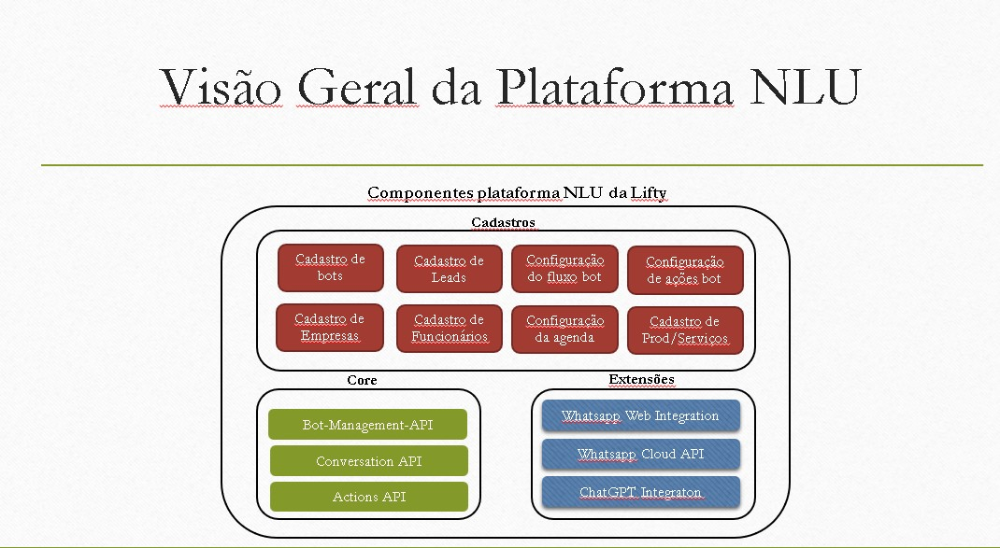

# README #
Botty NLU is the platform of Lifty Solution and its composed by three different micro-services:

**Actions API**, **Bot Management API** and **Conversation API**, 

### How do I get set up? ###

* Checkout the source in our favorite API, IntelliJ is recommended
* To local run the NLU Platform you need docker and docker-compose
* From the main folder just run:

`docker-compose up`

### Actions API ###
* A principal função da API de Ações é fazer a integração da agenda com a plataforma de gestão de bots da Lifty.
* A API de actions define uma interface comum indenpende do modo de integração utilizado, quer seja Google Calendar (atual) ou outras agendas.
* A API recebe objetos do cadastro do Bot Manager, como empresas e funcionarios, executando a lógica de encontrar um slot livre com facilidade.
* Além disso essa API prove outras funcionalidades como disparo de lembretes, envio de emails, etc
* A API de actions também fornece endpoints para funcionalidade de carrinho de compras, criando pedidos, adicionando ou removendo itens dos mesmos e controlando os statuses.

### Bot Management API ###
* Bot Management API é uma aplicação desenvolvida para integrar e administrar os diferentes robos (bots) usados na plataforma.
* Todas configurações também são mantidas por essa API, que persiste os mesmos em banco de dados NoSQL.
* Sessões de conversa com os bots e estatisticas de utilização e mensagens também são mantidas por essa aplicação.

### Conversation API ###
* Conversation API é projetado para abstrair a comunicação com o provedor NLU utilizado. Além disso fornecer funcionalidades adicionais.
* Integração facilitada com os outros sistemas, como CRMs e sistemas externos.
* Validação do fluxo de intents que o usuário pode executar.
* Execução de ações externas (como agendamento de reuniões).
* Gestão facilitada de multiplas credencials e configuração de ambiente.
* Limitador de uso simultaneo da API por bot simplificado.

### Who do I talk to? ###

* victor@lifty.com.br
* rafael.ide@lifty.com.br