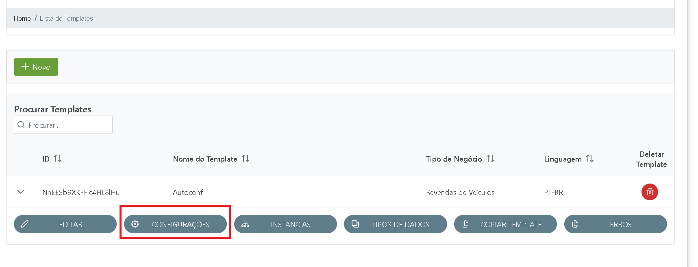
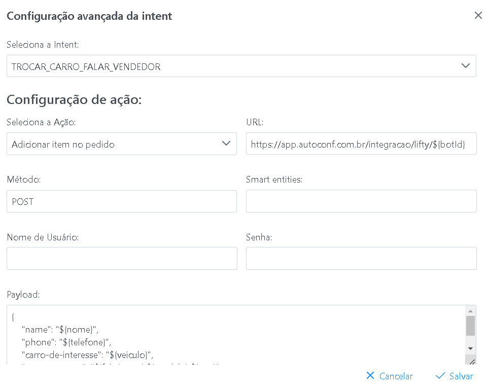
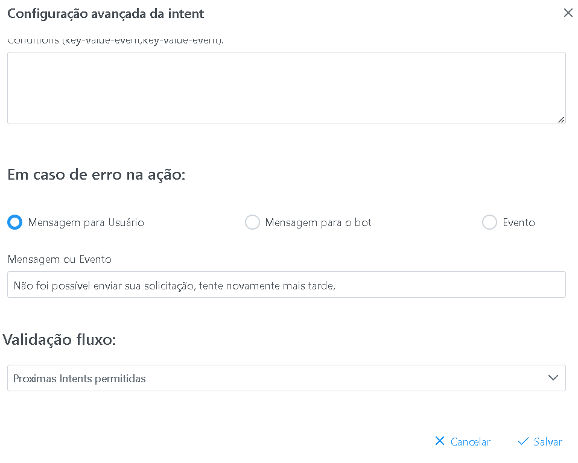

## Ações nos templates ##
Ao criar um novo template é possível fazer ações customizadas no mesmo.
Essas ações podem incluir uma ação da plataforma, como enviar mensagem em um grupo de whatsapp, enviar um email, criar uma reunião no google meeting, entre outros.

É possível também adicionar validações de fluxo, restrigindo a navegação entre as diferentes intents do projeto dialogflow.

E por fim, também é possível fazer integrações com sistemas externos, enviando parametros capturados nos fluxos entre outros, sendo possível também tratar os parametros recebidos e até fazer validações do fluxo caso os parametros retornados venham com valores específicos.

Para acessar a configuração de ações no admin UI acessar o botão abaixo:

E abaixo está a tela de edição de ação

*Observação:* É importante lembrar que ações e integrações serão executadas apenas no final da intent selecionada, ou seja, após todos parametros serem informados com sucesso e antes da resposta padrão.
Em caso de erro (retornos não HTTP 200) é possível exibir uma mensagem ao usuário, enviar uma mensagem ao robo (para ir pra outra intent) ou chamar um evento do dialogflow (também direcionando o fluxo para outra intent)

