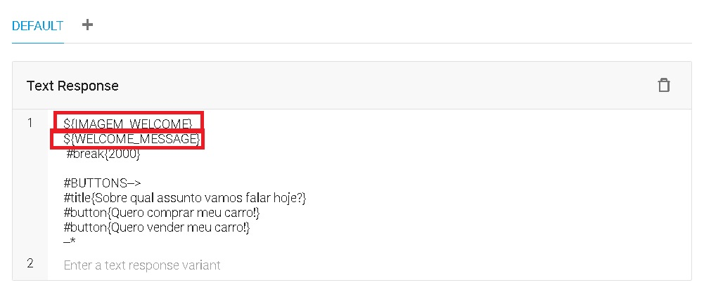
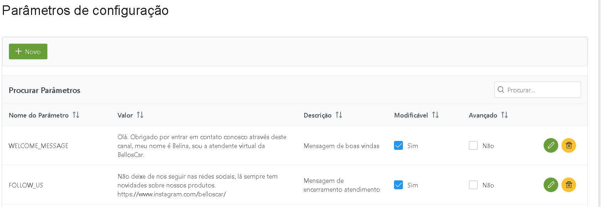
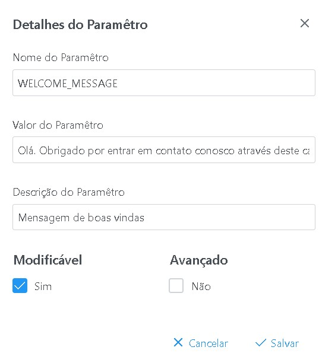
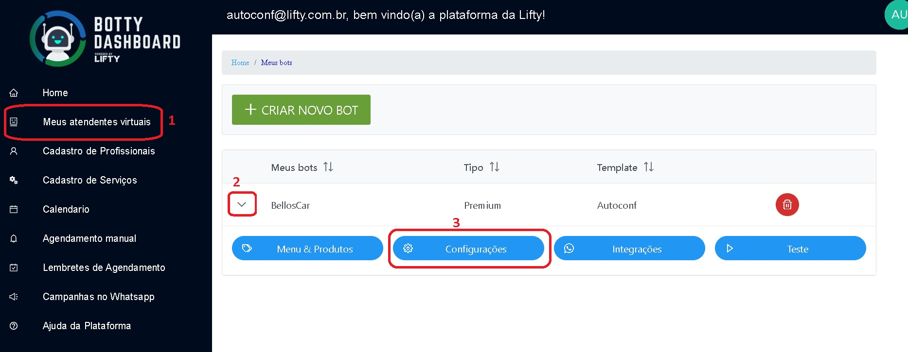
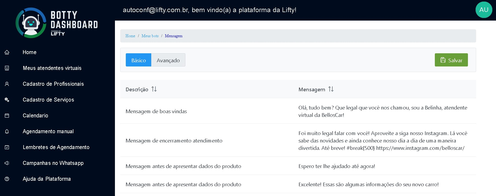

##Parametros nos templates
Dentro do fluxo de um template é possível definir parametros que terão seus valores configurados por cada bot.
Geralmente são mensagens de boas vindas, e mensagens de atendimento do fluxo de conversa, mas podem ser parametros que ativam e desativam funções ou até mesmo senhas e valores usados em integrações externas.
A sintaxe para utilizar um parametro na plataforma é muito simples:
`${parametro}`

A imagem abaixo mostra o uso de parametros na resposta do Dialogflow:

Obs: Os parametros podem ser usados também para prompts de variavéis do Dialogflow.

Dentro do Admin UI, nas configurações avançadas do template é que são criados os parametros.

###Criando parametros
Ao criar novos parametros é necessário definir o nome do parametro que é como ele será utilizado na tag ${}
Além disso é necessário colocar um valor padrão para o mesmo (inicial), e uma descrição para o parametro, lembrando que essa descrição será visualizada no dashboard.

Ao marcar o parametro como modifícavel o mesmo será passível de modificação dentro do dashboard, para cada robo com aquele template.
Ao marcar o parametro como avançado, ele aparecerá apenas na aba avançado na configuração do bot.

Parametros não modificavéis apenas serão utilizados internamente no template, e não serão alterados em nível de bot.

tela de criação de parametro

###Modificando parametros por bot
Conforme explicado acima, parametros de robo podem ser modificados para cada bot, e isso é feito dentro do dashboard.

Como acessar os parametros no sistema.

Tela de edição de parametros.

###Parametros de sistema
Além dos parametros criados no template, existem outros parametros disponíveis pelo próprio sistema que podem serem utilizados na plataforma.
Abaixo a lista com nomes e descrição:

| Parametro      | Description |
| ----------- | ----------- |
| botId      | Parametro que retorna o ID do bot       |
| botName   | Parametro que retorna o nome do bot          |
| tenantId   | Parametro que retorna o email do criador do bot          |
| businessLine   | Parametro que retorna o ramo de negócio do bot          |
| templateId   | Parametro que retorna o ID do template         |
| templateName   | Parametro que retorna o nome do template        |
| dialogflowProject   | Parametro que retorna o projeto dialogflow do template        |

###Parametros de comportamento
São parametros que podem alterar o comportamento do fluxo por template ou por robo.
Para alterar o comportamento basta incluir esses parametros no template e alterar seu valor por template ou por bot.

| Parametro     | Description    | Default |
| -----------   | -----------   | --------  |
| BOT_USE_LIST        | Quando ativado (true) exibe os modelos dinamicos como listas (combos)         | false     |
| USE_LIST_EMPTY     | Quando não encontrado nenhum item, retorna uma lista vazia se ativado          | false     |
| AUTO_SELECT_SUBITEMS  | Quando ativado (true) auto seleciona itens com apenas um sub-item em sua lista de filhos   | false     |
| BOT_REQUIRES_SESSION     | Quando ativado (true) faz o bot exigir uma comunicação anterior com o número, respondendo mensagens de números apenas após disparos iniciados pelo bot | false     |
| REQUIRED_SESSION_ERROR     | Mensagem de erro quando bot exigir uma comunicação anterior com o número, e o número que entrou em contato não tem uma sessão ativa | empty (vazia) |
| BOT_MESSAGE_SAVE | Quando ativado (true) faz o bot salvar na sessão todas mensagens enviadas e recebidas => Multi-atendedor | true     |
| AGENDA_USAR_SLOTS     | Quanto ativado (true) exibe os horários disponíveis para agendamento como listas (combos)  | false     |
| AUTOCONF_OFFTIME_BOT     | Fluxo Autoconf apenas: Quanto ativado (true)  bot responde apenas após loja fechada  | false     |

###Configurações de conexão por canal
São configurações do canal que podem alterar a maneira como o robo funciona naquele canal.
Para alterar essas configurações é necessário alterar a documento de integração na collection bot-integrations

| Parametro     | Description    | Default |
| -----------   | -----------   | --------  |
| createSessionOnSendingMsg | Quando ativado (true) sempre cria uma sessão em banco de dados ao realizar disparos | false |
| enableConfirmationMsgQueue | Quando ativado (true) ativa o sistema de fila de confirmações aguardando uma confirmação pra enviar a próxima | false |
| saveContextIdOnResponse   | Quando ativado (true) salva o id da conversação-contexto após o disparo de uma mensagem | false |

###Parametros de mensagens padrão
São mensagens comuns no fluxo de todos robos.
Para alterar essas mensagens basta incluir esses parametros no template e alterar seu valor por template ou por bot.

| Parametro     | Description    | Default |
| -----------   | -----------   | --------  |
| MENSAGEM_SEM_OPCOES  | Mensagem que o robo exibe uando não existem opções a serem selecionadas  | Sem opções disponíveis  |
| NO_TEXT_FOR_MODEL   | Quando não existe texto cadastrado para o modelo dinamico | (texto não cadastrado para opção) |
| TEMPLATE_LIST_TITLE | Título da lista dinamica quando usa combo | #title{Menu;Escolha uma opção} |
| NO_CHILDREN_FOR_INPUT_MODEL | Quando não existem opções para um modelo dinamico ou para uma sessionMeeting | Sem opções encontradas para o modelo.
| DEFAULT_OPTION_MODEL_SUBITEMS | Titulo para o subitem da lista dinamica | Para opção escolhida: [OPCAO], por favor especifique uma das opções abaixo: |
| SKIP_VALIDATION_WORDS | Caracteres ou palavras que não são validadas nas listas dinamicas, separadas por ; | # |
| TEMPLATE_OPCOES_MENU | Define o template utilizado para as listas dinamicas, letra, separador e descrição | [LETRA_OPCAO] : [DESCRICAO_OPCAO] |
| ITEM_DESCRIPTION | Para fluxos que usam o carrinho de compras, formata a exibição dos itens no mesmo | [ITEM_NOME] - Quantidade: [ITEM_QUANTIDADE] - Valor: R$ [ITEM_VALOR] |

###Funções de formatação de parametros
São funções especiais que podem ser usadas para formatar alguns tipos de parametros como datas.
São úteis especialmente para integrações com APIs que esperam parametros em formatos não universais (UTC).

| Função     | Description    | Exemplo |
| -----------   | -----------   | --------  |
| #fdate | Formata Data/Hora do padrão UTC para um padrão qualquer. Recebe dois parametros, um com valor e outro com formato, sendo que o primeiro pode ser uma variável. Valores aceitos para formato: yyyy-MM-dd HH:mm:ss" | #fdate[${date}, dd/MM/yyyy]: Para formatar a data em dd/mm/aaaa. |