# Tags  #
Conversation API has several special tags that can be used for handling different functions.
These tags are divided in three categories and explained here

## Dynamic Input Tags ##
Essas tags são usadas para oferecer uma opção de input dinamico, como por exemplo lisas vindo de modelos mantidos pelo usuário e definido em nível de bot.
Essas tags devem ser usadas dentro do dialogflow como action and parameters.

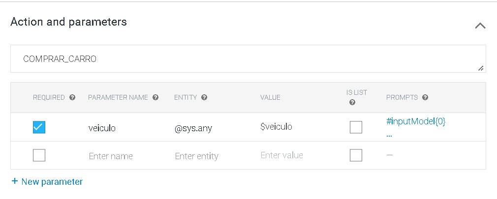

### inputModel ####
Input model cria uma lista dinamica de produtos, ou opções dinamicas para o usuário escolher.
Ele pode ser exibido como uma lista com letras A, B, C em caso de API não oficiais ou como um select em caso de API oficial whatsapp.
A renderização desse componente vai variar de acordo com o conector e o canal utilizado.

**Como usar:**
`#inputModel{0}` onde **0** é o indice do modelo dinamico utilizado.
O modelo dinamico pode vir de um sistema externo ou pode ser mantido dentro do dashboard.

Os modelos dinamicos são acessados clicando no botão abaixo:
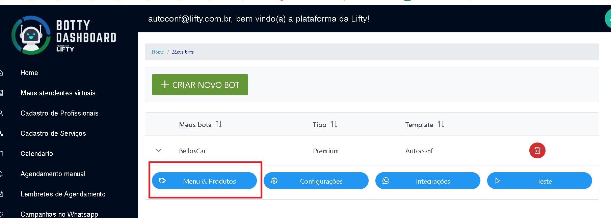

E podem ser facilmente editados em formato de arvore de dados conforme imagem abaixo:
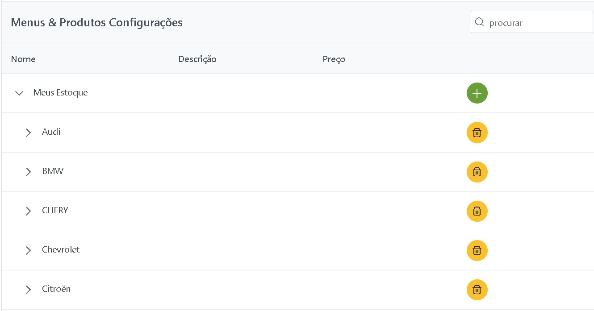


### inputActionModel ####
Assim com em Input model essa tag cria uma lista dinamica de produtos, ou opções dinamicas para o usuário escolher.
A diferença é que a lista vem de outra intent do Dialogflow, e o fluxo chama essa intent para obter o modelo.
Isso permitir fazer integrações com sistemas externos para obter a lista de modelos dinamicos, ou mesmo simplesmente manter em uma intent diferente.
**Como usar:**
`#inputActionModel{ACTION_1}` onde **ACTION_1** é o nome da ação a ser chamada (nome do evento da mesma).
O modelo dinamico deve retorna em um formato específico de JSON.

Os modelos dinamicos formato de JSON esperado:
```json
{
            "key": "0",
            "data": {
                "name": "Lista especialidades",
                "type": "folder"
            },
            "children": [
                {
                    "key": "0-1",
                    "data": {
                        "name": "Clinica geral",
                        "type": "text",
                        "value": {
                            "code": "1",
                            "name": "Clinico geral"
                        }
                    }
                },
                {
                    "key": "0-2",
                    "data": {
                        "name": "Pediatra",
                        "type": "text",
                        "value": {
                            "code": "2",
                            "name": "Pediatra"
                        }
                    }
                }
            ]
        }
```

### inputItem ####
Geralmente utilizada para carrinhos de compras e deve sempre ser utilizada após o inputModel.
Essa tag vai salvar o item no formato JSON para ser enviado para a API de Carrinho de compras.
É importante que o item possua o valor do mesmo no modelo em formato númerico, ou haverá erro de conversão.

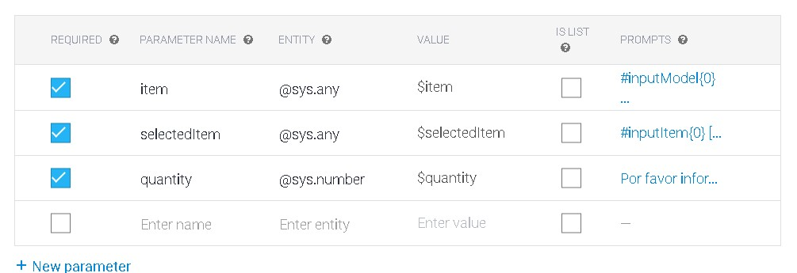

**Como usar:**
`#inputItem{0}` onde **0** é o indice da lista de produtos para ser listada

### inputMeetings ###
Geralmente utilizada para cancelar agendamentos para o telefone quando está sendo usada a agenda integrada da plataforma (Google Agenda).
Lista todos os agendamentos para o telefone informado.
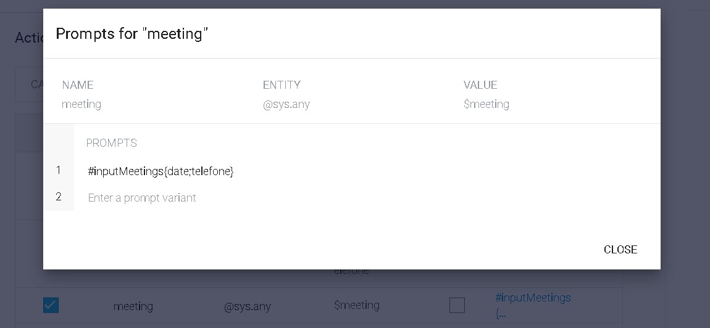

**Como usar:**
`#inputMeetings{data, telefone}` onde **data** é a data inicial para buscar os agendamentos, e **telefone** é número de telefone que foi utilizado no processo de agendamento.

Geralmente é combinado com outras tags internas como na imagem abaixo:
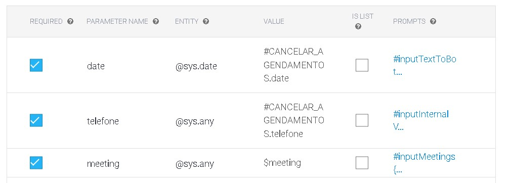

Na imagem acima, o valor de date é enviado ao bot com `#inputTextToBot{hoje}`, setando a variavel date para a data de hoje.
E o telefone é setado para `#inputInternalVariable{conversationRequest.participantId}` pegando o número do whatsapp automaticamente.

Abaixo está um exemplo de como inputMeetings é renderizado no whatsapp utilizando a Cloud API:
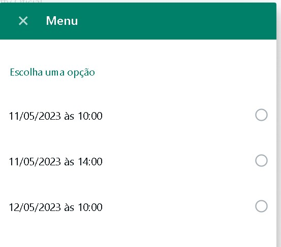

### sessionMeetings ####
Essa tag deve ser usada para fluxos de confirmação de consulta onde a integração cria uma sessão.
Para tal `createSessionOnSendingMsg` da coleção bot-integrations deve estar *true*
Também é importante que na mensagem de disparo da integração, quer seja template ou simple message seja informado
os seguintes campos:
`meetingId` que contém o ID do agendamento.
`meetingTitle` que contém a descrição (título) do agendamento.

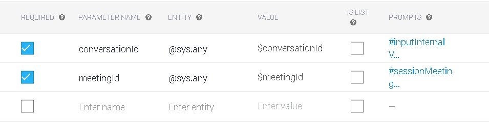

**Como usar:**
`#sessionMeetings{0}` onde **0** é apenas um identificador interno.


### inputService ###
Semelhante ao inputModel porém com a diferença que deve ser utilizado apenas para escolher o serviço que será agendado.

**Como usar:**
`#inputService{0}` onde **0** é o indice do modelo dinamico utilizado.
O modelo dinamico pode vir de um sistema externo ou pode ser mantido dentro do dashboard.

A grande diferença é que na tela de edição de modelo, o modelo possui uma lista de serviços para aquele template e não produtos, e como serviços estão associados a um tipo de agendamento conforme imagem abaixo:
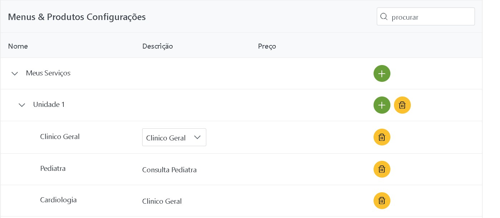

### inputInternalVariable ###
A conversation API possui algumas variaveis internas, e as vezes dentro do fluxo é necessário obter o valor dessas variavéis internas.
Usando essa tag é possível atribuir o valor da variável interna para uma variável do fluxo do Dialogflow, como por exempo o identificador do participante no canal e outros valores.
`#inputService{conversationRequest.participantId}` onde **conversationRequest.participantId** é a varível interna que pega o ID do participante no canal, que no whatsapp é o número de telefone.

Outras variavéis possíveis são:
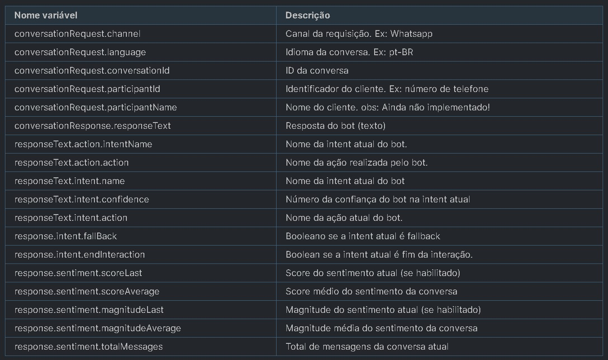

## Dynamic Reply Tags ##
Essas tags são usadas para oferecer uma resposta dinamica para o usuário no fluxo, geralmente são utilizadas após um input dinamico e para oferecer respostas de acordo com o item escolhido no input dinamico.
Ao contrário das tags de input não é esperado um retorno do usuário.
Também podem ser utilizadas como parametros no dialogflow, mas o mais comum é que façam parte do fluxo de resposta.

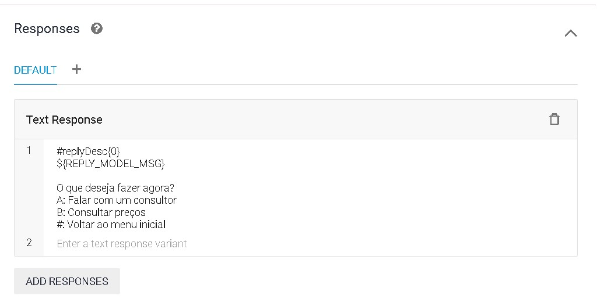

### replyDesc ####
Tem dependencia direta com inputModel, pois requer na mesma intent um inputModel
Retorna a descrição do item dinamico selecionado, de acordo com o cadastrado.

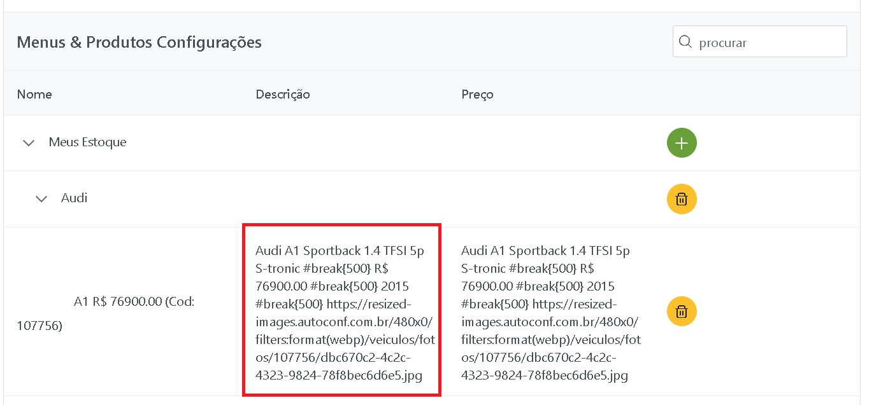

**Como usar:**
`#replyDesc{0}` onde **0** é o indice do modelo dinamico (deve ser o mesmo indice do inputModel)

### replyName ####
Tem dependencia direta com inputModel, pois requer na mesma intent um inputModel
Retorna a título do item dinamico selecionado, de acordo com o cadastrado.

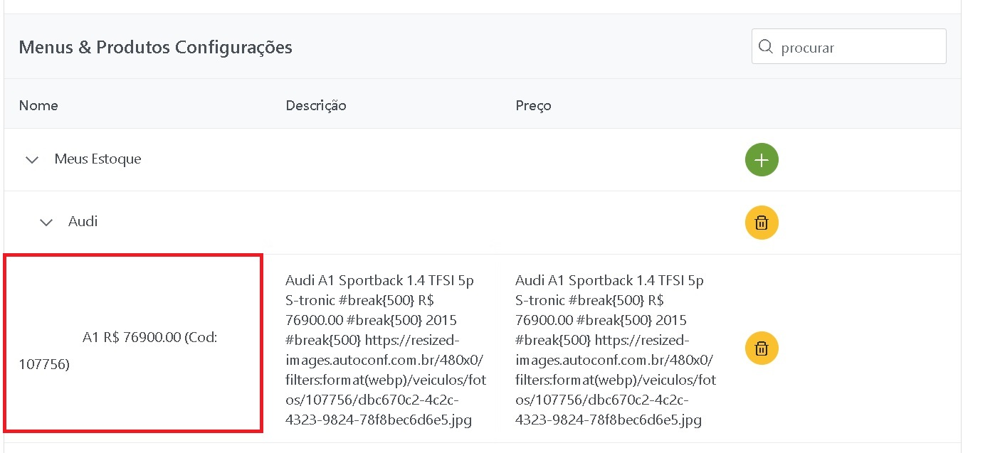

**Como usar:**
`#replyName{0}` onde **0** é o indice do modelo dinamico (deve ser o mesmo indice do inputModel)

### replyPrice ####
Tem dependencia direta com inputModel, pois requer na mesma intent um inputModel
Retorna o preço (ou mensagem cadastrada no mesmo) do item dinamico selecionado, de acordo com o cadastrado.

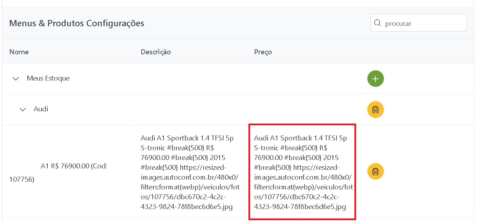

**Como usar:**
`#replyPrice{0}` onde **0** é o indice do modelo dinamico (deve ser o mesmo indice do inputModel)


### replyTime ####
Tem dependencia direta com inputService, pois requer na mesma intent um inputService
Retorna o tempo de duração do serviço dinamico selecionado, de acordo com o cadastrado.
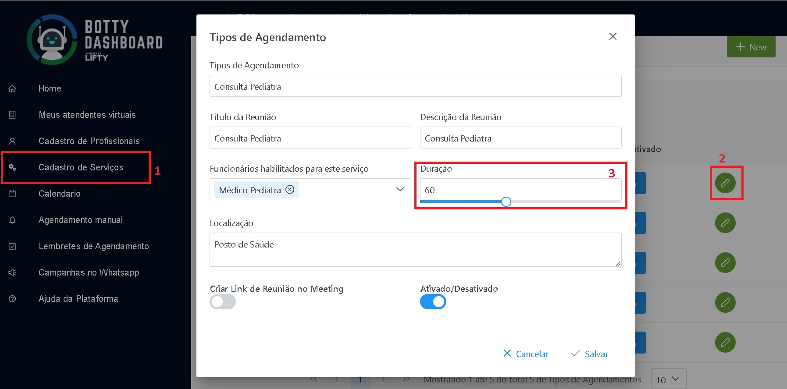


**Como usar:**
`#replyTime{0}` onde **0** é o indice do modelo dinamico (deve ser o mesmo indice do inputModel)

### replyServiceName ###
Tem dependencia direta com inputService, pois requer na mesma intent um inputService
Retorna o título do serviço dinamico selecionado, de acordo com o cadastrado.


**Como usar:**
`#replyServiceName{0}` onde **0** é o indice do modelo dinamico (deve ser o mesmo indice do inputModel)


## Rich output format Tags ##
Essas tags são usadas para oferecer um formato de resposta rich para o usuárioo em todas as plataformas, como por exemplo: imagens, vídeos, botões de ações, entre outros.
Além disso podem oferecer funcionalidades de experiência com o usuário como aguardar antes de enviar a próxima mensagem.

Geralmente são metatags utilizadas dentro do retorno (response) das intents do Dialogflow.

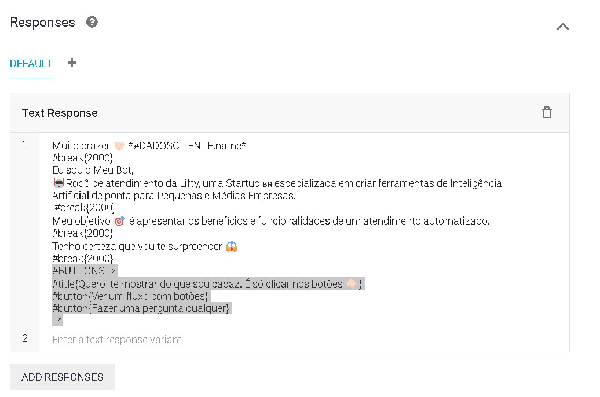

### IMAGEM ###
Envia uma imagem no canal (Whatsapp/Web/Etc).
Essa imagem deve estar em uma URL pública usando HTTP ou HTTPS.


**Como usar:**
`#IMAGEM{URL}` onde **URL** é o endereço público e completo da imagem

### VIDEO ###
Envia uma vídeo no canal (Whatsapp/Web/Etc).
Essa vídeo deve estar em uma URL pública usando YouTube.

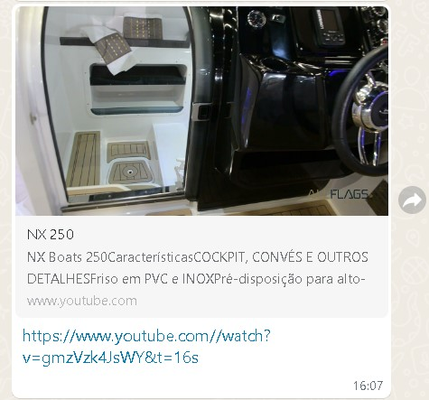

**Como usar:**
`#video{URL}` onde **URL** é o endereço público do vídeo no YouTube.

### AUDIO ###
Envia um audio no canal (Whatsapp/Web/Etc).
Essa aúdio deve estar em uma URL pública e no formato .oga


**Como usar:**
`#audio{URL}` onde **URL** é o endereço público e completo da imagem

### CONTACT ###
Envia um contato no canal (Whatsapp/Web/Etc).
Essa contato deve ser um número de telefone, e atualmente funcion apenas em whatsapp.

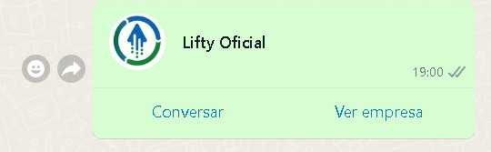

**Como usar:**
`#contact[telefone]` onde **telefone** é o telefone do contato.

### BREAK ###
Executa uma pausa e uma quebra de linha (mensagem) onde for encontrado.
Utilizado para deixar o robo mais 'lento' e a conversa mais natural.

**Como usar:**
`#break[2000]` onde **2000** é o intervalo em milisegundos que o robo vai esperar.

### LIST ###
Exibe uma lista de opções para o usuário selecionar de acordo com a plataforma conectada.

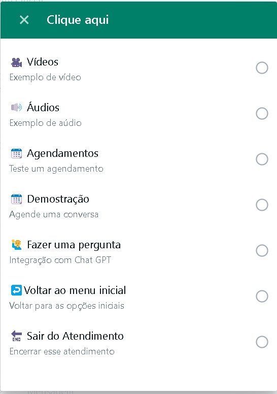

**Como usar:**
```
#LIST-->
#title{Clique aqui; Selecione uma opção}
#option{🎥 Vídeos; Exemplo de vídeo}
#option{🔊 Áudios;Exemplo de aúdio}
#option{📆 Agendamentos; Teste um agendamento}
#option{📆 Demostração;Agende uma conversa}
#option{🙋‍♂️ Fazer uma pergunta; Integração com Chat GPT}
#option{↩️Voltar ao menu inicial;Voltar para as opções iniciais}
#option{🔚 Sair do Atendimento;Encerrar esse atendimento}
--*
```
Onde **#LIST-->** abre o componente e **--*** fechar o componente. 
Lembrando que cada opção é uma tag #option e contém o título e também o subtítulo separado por ;
E a tag #title contém o label do botão e o título do mesmo separados por ; e são obrigatórios.

### BUTTON ###
Exibe uma lista de opções para o usuário selecionar de acordo com a plataforma conectada.

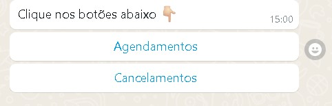

**Como usar:**
```
#BUTTONS-->
#title{Clique nos botões abaixo 👇🏻}
#button{Agendamentos} 
#button{Cancelamentos}
--*
```
Onde **#BUTTONS-->** abre o componente e **--*** fechar o componente.
Lembrando que cada botão é uma tag #button e contém o texto do botão
E a tag #title contém o texto antes dos botões, que é um parametro obrigatório.

### FOREACH ###
Pode varrer um array de resultados, e é útil onde existe integrações com sistemas externos que retornam um array de informações.
As informações retornadas no endpoint são devolvidas como texto no canal de integração.

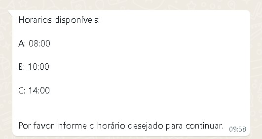

**Como usar:**
```
--FOR[
${horarios.letra}: ${horarios.horario}
]--
Por favor informe o horário desejado para continuar.
```
Onde **horarios.horario** e **horarios.letra** são retornos de uma API Externa.

Retorno de API externa (exemplo utilizado no for): 
```json
{
	"horarios": [
		{
			"letra": "A",
			"horario": "08:00"
		},
		{
			"letra": "B",
			"horario": "10:00"
		},
		{
			"letra": "C",
			"horario": "14:00"
		}
	]
}
```